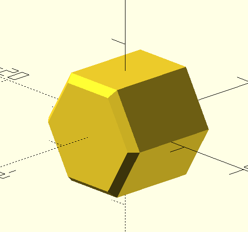
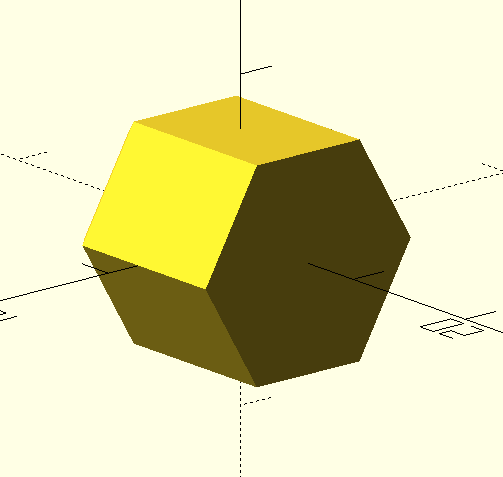
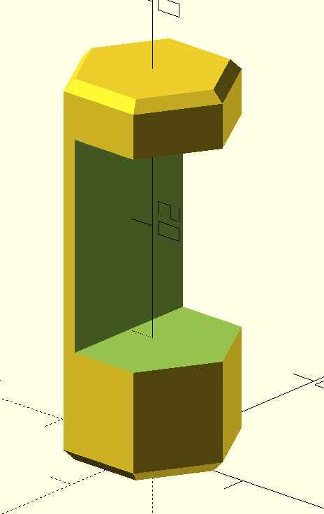
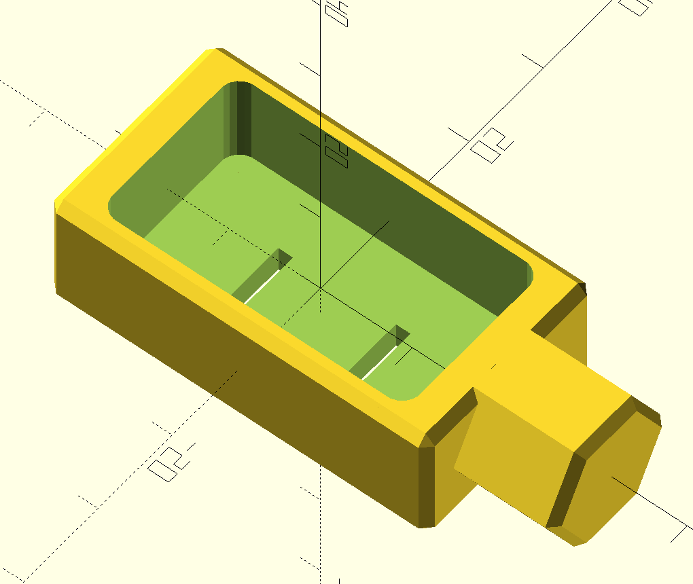

# Parametric Honeycomb Storage Wall Parts

This is my collection of OpenSCAD designs for the [Honeycomb Storage Wall](https://www.printables.com/model/152592-honeycomb-storage-wall). All parts are created with [OpenSCAD](https://openscad.org/), the [BOSL Library](https://github.com/revarbat/BOSL), and the [MCAD Library](https://github.com/openscad/MCAD). Here are some resources that I found helpful and frequently use when working with OpenSCAD:

* [OpenSCAD Cheat Sheet](https://openscad.org/cheatsheet/index.html)
* [BOSL Wiki](https://github.com/revarbat/BOSL/wiki)
* [HSW README](https://www.printables.com/model/152592-honeycomb-storage-wall) for part dimensions.

## Parts

### Insert Hex Mount





This is a module for creating a hexagonal mount for the hollow inserts. To use it, you can `use <insertHexMount.scad>` within this directory, and then call the module with the following parameters:

```c
mount_hex(thickness = 12, chamfer1 = 0, chamfer2 = 1)
```

The `thickness` parameter is the thickness of the mount. The `chamfer1` and `chamfer2` parameters are the chamfer distances for the top and bottom of the mount, respectively. The chamfers are used to make the mount easier to insert into the honeycomb wall.

Here are some images of the default mount:

### Parametric Hook



This is an adjustable hook that can be modified by adjusting the variables on lines 6-11.

```c
// all in mm
// modify for item
hook_type = "side"; // "bottom" or "side"
top_height = 5;
item_thickness = 19;
hex_chamfers = 1;
inner_chamfers = 0;
hook_depth = 11;
```

This will create a hook that will mount the item with the specified thickness as close to the wall as possible. The `top_height` parameter adjusts the thickness of the end of the hook. The `hex_chamfers` adjust the chamfers at the ends of the hook, the `inner_chamfers` adjust the chamfers inside the hook. The `hook_type` parameter adjusts the orientation of the hook. The `item_thickness` parameter adjusts the thickness of the item that the hook will hold. The `hook_depth` parameter adjusts the depth of the hook.

### Samsung Wall Wart Holder



This is a holder for the Samsung wall wart that comes with the Galaxy S22. That's it.
